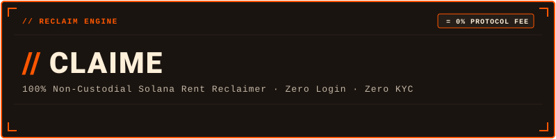

### // RECLAIM ENGINE

> **100% Non-Custodial Solana Rent Reclaimer.**  
> Closes empty SPL and Token-2022 token accounts and unwraps WSOL. Recovered SOL returns directly to the signing wallet. Zero login. Zero KYC. Zero protocol fee.

[](https://solana.com)
[](https://quillhog.xyz/claime)
[](https://github.com/quillhog0/claime/actions)
[](#-02-security--invariants)
[](LICENSE)

---

## // 01 WHAT IS CLAIME?

Every time a wallet interacts with a token on Solana, an **Associated Token Account (ATA)** is created. Each account locks approximately **0.002039 SOL** as a rent-exempt deposit.

When all tokens are sold or transferred, these empty accounts remain open indefinitely, trapping SOL on-chain.

**Claime** inspects the wallet, identifies eligible empty accounts, and compiles an unsigned `VersionedTransaction` (MessageV0) that executes the `CloseAccount` instruction (opcode 9), releasing 100% of the locked SOL directly back to the signing wallet.

- **0.00% Protocol Fee:** The ceiling is hardcoded to 0 bps. The builder never adds a fee transfer. Every recovered lamport stays with the owner. Network signature fees still apply.
- **WSOL Auto-Unwrap:** Automatically closes Wrapped SOL accounts, returning both the rent deposit and any trapped native SOL.
- **SPL & Token-2022 Support:** Fully supports standard SPL Token and Token-2022 programs.
- **Non-Custodial:** Server never sees, stores, or handles private keys. Transactions are signed entirely on the client side.

---

## // 02 SECURITY & INVARIANTS

All transaction compilation is strictly verified against hardcoded invariants in `core_verify.py`:

| Invariant | Specification | Enforcement Mechanism |
| :--- | :--- | :--- |
| **Non-Custodial** | `dest == owner == signer` | Core rejects any instruction where the destination address does not match the signer. |
| **MTU Packet Limit** | Max **15 accounts** / batch | Transaction payload is strictly capped under 1232 bytes to prevent IPv6/UDP network packet drop. |
| **Fee Ceiling** | Hardcoded **0.00% / 0 bps** | `MAX_FEE_BPS = 0`. Any positive fee is rejected. The transaction builder does not insert a fee transfer. |
| **SEC-01 (Close Authority)** | Authority verification | Skips accounts where `closeAuthority` is delegated or does not match owner. |
| **SEC-02 (Transfer Fees)** | Token-2022 fee check | Skips Token-2022 accounts with withheld transfer fees to prevent on-chain transaction reverts. |
| **SEC-03 (Gas Reserve)** | Network fee check | `/api/scan` reports `has_fee_reserve` when native balance is at least 0.00001 SOL. `/api/rent/build-tx` refuses to build if the reserve is missing. |
| **SEC-04 (Frozen State)** | Account state guard | Filters out frozen token accounts. |

---

## // 03 CORE COMPONENTS

- `core_verify.py` — Pure calculator and validator with zero network I/O. Computes lamports, executes SEC-01..04 filters, and compiles `CloseAccount` instructions.
- `rent_service.py` — Asynchronous FastAPI service handling account scanning, Solana Pay 2-step transactions, and rate limiting (10 req / 60 s / IP).

> **Note on Rate Limiting:** Rate limiting is enforced per-worker in memory. Run with a single worker (`--workers 1`), or share request state across workers via Redis if scaled horizontally.

- `rpc_pool.py` — RPC failover client with thread-safe node rotation and exponential backoff.
- `observability.py` — SQLite WAL ledger. Settlements store the public wallet address and signature. Analytics stores a salted SHA-256 of the IP (first 16 hex chars) only when `ANALYTICS_SALT` is set, plus a truncated user-agent. No cookies. No private keys.

---

## // 04 INSTALLATION & LOCAL RUN

### Requirements
- Python 3.12+
- Solana RPC endpoint (Helius or public mainnet-beta)

```bash
# 1. Clone repository
git clone https://github.com/quillhog0/claime.git
cd claime

# 2. Create and activate virtual environment
python -m venv .venv
source .venv/bin/activate  # Windows: .venv\Scripts\activate

# 3. Install dependencies
pip install -r requirements.txt

# 4. Run automated test suite (46 tests)
pytest -v

# 5. Start local service
uvicorn rent_service:app --reload --port 8000
```

---


## // 05 ENVIRONMENT VARIABLES

| Variable | Description | Default | Required |
| :--- | :--- | :--- | :--- |
| `HELIUS_API_KEY` | Helius RPC API key for primary Solana mainnet connection. | *(none)* | Optional |
| `SOLANA_RPC_URLS` | Comma-separated list of secondary Solana RPC endpoints. | `https://api.mainnet-beta.solana.com` | Optional |
| `ANALYTICS_SALT` | Secret salt used for daily salted SHA-256 cookieless IP hashing. | Auto-generated daily | Optional |
| `NTFY_TOPIC` | ntfy.sh topic name for operational telemetry and daily digests. | *(disabled)* | Optional |
| `STATS_TOKEN` | Secret authorization bearer token for `/api/stats` endpoint. | *(disabled)* | Optional |
| `RECLAIM_DB_PATH` | Path to persistent SQLite WAL ledger database. | `reclaim_vault.db` | Optional |
| `TRUST_PROXY_HEADERS` | Whether to trust `X-Forwarded-For` / `X-Real-IP` behind reverse proxy. | `false` | Optional |

## // NOTICE

*Claime provides cryptographic visualization and unsigned transaction serialization tools for public on-chain ledger records. This software does not provide tax, legal, or financial advice. Users retain 100% custody of their private keys and are solely responsible for transaction signing.*
